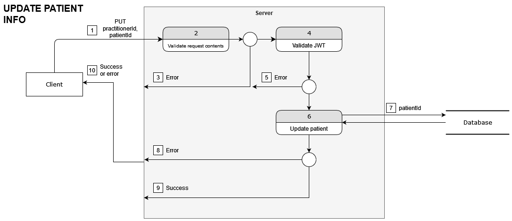
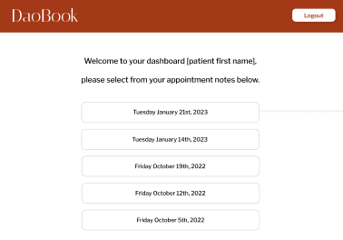
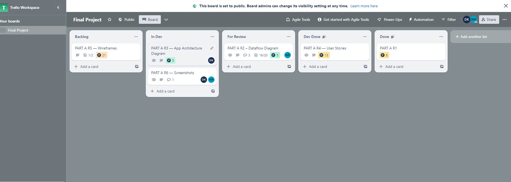

# Dao Book

## Clinic Management Software

Dao Book is a clinic management software made specifically for Chinese medicine practitioners. In its earliest version, it will provide support for herbalists, and in later versions it may integrate functionality for acupuncture and other branches of Chinese medicine.

 

---

### **Purpose**

---

Dao Book exists to:

- streamline the consultation process for practitioners
- provide a long-term and affordable solution to storing patient notes and prescription histories
- provide the ability for patients to access their own prescription history

 

---

### **Functionality & Features**

---

**_MVP_**

The foundation application will allow the practitioner to:

- Create new patient profiles
- Create individual session notes
- Record prescriptions
- View all patients relevant to the practitioner
- View all session notes and prescriptions for all patients relevant to the practitioner

#### **_Further features_**

To further fulfil the above mentioned purposes, the application will ideally also include the following features:

- Within each session record, the practitioner can select to have an automated email sent to the patient that will include: the presciption, dosage and administration, other lifestyle recommendations.
- Patients will be able to access their own prescription history through logging into the platform.

 

---

### **Target Audience**

---

Chinese medicine practitioners who want a streamlined and simplified patient record software that is specified to their industry, who in addition value their patients being able to access their own prescription data.

 

---

### **Tech Stack**

---

- MongoDB
- Express.js
- React.js (Vite)
- Node.js
- Express Router
- TailwindCSS
- Json Web Tokens
- Nodemailer

 

---

### **Data Flow Diagrams**

---

#### REGISTER

1. The client submits a POST request containing the new practitioner's email and password. This POST request comes from an HTML form.
2. The request content is validated, ensuring all required fields are populated and of the correct datatype. In this case, the email and password must be a string, in the form of an email, and the password must pass minimal security requirements. If this is not the case, an error is thrown to Step 3. Otherwise, proceed to Step 4.
3. The error is returned by the server containing information about the incorrectly supplied request.
4. The server upserts the user into the database, which ensures we only require one trip to the database.
5. The database receives an email and password for a given user. If the user does not exist, it will be created. If the user exists already, nothing happens. If the DB encounters an error, it's thrown to step 6. On a successful insert, proceed to Step 7.
6. The error is returned by the server. This error remains vague as to not divulge DB information.
7. A JWT is issued and returned to the client.
8. The JWT complies to the OAuth spec, containing an access_token & token_type in JSON format.
9. The response from server contains either an Error object or a valid JWT. The client then redirects the successfully logged-in user.

#### LOGIN

1. The client submits a POST request containing the practitioner's email and password. This POST request comes from an HTML form.
2. The request content is validated, ensuring all required fields are populated and of the correct datatype. In this case, the email and password must be a string, in the form of an email, and the password must pass minimal security requirements. If this is not the case, an error is thrown to Step 3. Otherwise, proceed to Step 4.
3. The error is returned by the server containing information about the incorrectly supplied request.
4. The database is queried for the user. If the user does not exist, an error is thrown to Step 6. If the user's password hash does not match the password hash in the database, an error is thrown to Step 6. Otherwise, proceed to step 7.
5. We retrieve the entire User document from the database before validating the password.
6. The error returned by the server does not contain information about whether the account exists or not, as this may be used maliciously for enumeration.
7. A JWT is issued and returned to the client.
8. The JWT complies to the OAuth spec, containing an access_token & token_type in JSON format.
9. The response from server contains either an Error object or a valid JWT. The client then redirects the successfully logged-in user.

#### CREATE PATIENT

1. The client submits a POST request containing the new information related to the patient. This includes their full name, email, and date of birth. This POST request comes from an HTML form.
2. The request content is validated, ensuring all required fields are populated and of the correct datatype. This may be a string for the name and email or a valid string that becomes a JS Date object. The request must contain a valid JWT, as only practitioners are able to register patients. If this is not the case, an error is thrown to Step 3. Otherwise, proceed to Step 4.
3. The error is returned by the server containing information about the incorrectly supplied request.
4. The server upserts the patient user into the database, which ensures we only require one trip to the database.
5. The database receives the patient information. If the patient does not exist, as determined by email, it will be created. If the patient exists already, nothing happens. If the DB encounters an error, it's thrown to step 6. On a successful insert, proceed to Step 7.
6. The error is returned by the server. This error remains vague as to not divulge DB information.
7. A confirmation message is generated by the server.
8. This confirmation message contains a HTTP code 201 and a confirmation message in JSON format.
9. The response from server contains either an Error object or a confirmation message.

#### LOGIN (Patient)

1. The client submits a POST request containing the patient's email, last name, and DOB (this object is called patientLogin). This POST request comes from an HTML form.
2. The request content is validated, ensuring all required fields are populated and of the correct datatype. If this is not the case, an error is thrown to Step 3. Otherwise, proceed to Step 4.
3. The error is returned by the server containing information about the incorrectly supplied request.
4. The email is used to make a database call to determine if the patient user exists. If the user does not exist, an error is thrown to Step 6. Otherwise, proceed to Step 7.
5. The patient document is retrieved.
6. The error is returned by the server. This error remains vague as to not divulge DB information.
7. The fields in the patientInfo object are compared to the patient Document. If it matches, a valid JWT is returned. If invalid, an Error is thrown to Step 6.
8. If the client receives a successful JWT, the user is redirected to the application. Otherwise, an error is displayed.

#### GET PATIENT LIST

1. The client submits a GET request. This GET request comes with a JWT token in the Header.
2. The JWT is validated. If it fails validation, an error is thrown to Step 3. Otherwise, proceed to Step 4.
3. The error is returned by the server containing information about the incorrectly supplied request with a status code of 403 Unauthorized.
4. Using the practitionerId inside the JWT, we make a DB request for all the patients associated with the ID. If unsuccessful, an error is thrown to Step 5. Otherwise, proceed to Step 6.
5. The error is returned by the server. This error remains vague as to not divulge DB information.
6. The practitionerId is used to get all patient Documents from the server.
7. The list of patients is sent in a JSON format to the client.
8. The response from the server contains either an Error object or the patient list.

#### UPDATE PATIENT INFO

1. The client submits a PUT request. This PUT request contains a JWT in the Header, and JSON as the body containing the patientId, and the new patient information.
2. The request is validated. In this case, the patientId must be a string. The fields must be strings. If it fails validation, an error is thrown to Step 3. Otherwise, proceed to Step 4.
3. The error is returned by the server containing information about the incorrectly supplied request with a status code of 403 Unauthorized.
4. The JWT is validated. If it fails validation, an error is thrown to Step 5. Otherwise, proceed to Step 6.
5. The error is returned by the server containing information about the incorrectly supplied request with a status code of 403 Unauthorized.
6. The patientId is used to send an update to the database. If unsuccessful, an error is thrown to Step 8. Otherwise, proceed to step 9.
7. The patientId updates the Document in the database. The update returns the Document.
8. The error is returned by the server. This error remains vague as to not divulge DB information.
9. The updated patient info is sent in a JSON format to the client.
10. The response from the server contains either an Error object or the new patient Document.

#### CREATE CONSULTATION

1. The client submits a POST request containing the new consultation information. This POST request comes from an HTML form.
2. The request content is validated, ensuring all required fields are populated and of the correct datatype. In this case, the consultation fields must be strings, or a date. If this is not the case, an error is thrown to Step 3. Otherwise, proceed to Step 4.
3. The error is returned by the server containing information about the incorrectly supplied request.
4. The JWT is validated. If it fails validation, an error is thrown to Step 5. Otherwise, proceed to Step 6.
5. The error is returned by the server containing information about the incorrectly supplied request with a status code of 403 Unauthorized.
6. The patientId is confirmed to exist. If the patient does not exist, we throw an Error to Step 8. Otherwise, proceed to Step 9.
7. The patientId is sent to the database.
8. The error is returned by the server. This error remains vague as to not divulge DB information.
9. A new consultation is created on the server and populated with the fields from the request. This document is sent to the database. If an error is encountered, it is sent instead of the new consultation.
10. The consultation is a new Document.
11. The response from server contains either an Error object or the new Consultation with a status code of 201.

#### GET CONSULTATIONS

1. The client submits a POST request. This POST request contains a JWT in the Header and JSON as the body containing the patientId.
2. The request is validated. In this case, the patientId must be a string. If it fails validation, an error is thrown to Step 3. Otherwise, proceed to Step 4.
3. The error is returned by the server containing information about the incorrectly supplied request with a status code of 403 Unauthorized.
4. The JWT is validated. If it fails validation, an error is thrown to Step 5. Otherwise, proceed to Step 6.
5. The error is returned by the server containing information about the incorrectly supplied request with a status code of 403 Unauthorized.
6. All consultations related to that patient are requested from the database. If the patient does not exist, no consultations are returned, but the request is still considered valid. If another error is encountered, it is thrown to Step 8. Otherwise, proceed to Step 9.
7. The patientId is sent to the database.
8. The error is returned by the server. This error remains vague as to not divulge DB information.
9. All consultation Documents related to the patientId are sent to the client.
10. The response from server contains either an Error object or the consultation list with a status code of 200.

#### UPDATE CONSULTATION

1. The client submits a PUT request. This PUT request contains a JWT in the Header, and JSON as the body containing the consultationId and the new consultation info.
2. The request is validated. In this case, the consultationId must be a string. The fields must be strings. If it fails validation, an error is thrown to Step 3. Otherwise, proceed to Step 4.
3. The error is returned by the server containing information about the incorrectly supplied request with a status code of 400 Bad Request.
4. The JWT is validated. If it fails validation, an error is thrown to Step 5. Otherwise, proceed to Step 6.
5. The error is returned by the server containing information about the incorrectly supplied request with a status code of 403 Unauthorized.
6. The consultation update is sent to the database. If an error is encountered, it is thrown to Step 8. Otherwise, proceed to step 9.
7. The consultationId and the new consultation fields are sent to the database.
8. The error is returned by the server. This error remains vague as to not divulge DB information.
9. The updated consultation Document is sent to the client.
10. The response from server contains either an Error object or the updated consultation with a status code of 200.

#### DELETE CONSULTATION

1. The client submits a DELETE request. This DELETE request contains a JWT in the Header, and JSON as the body containing the consultationId.
2. The request is validated. In this case, the consultationId must be a string. If it fails validation, an error is thrown to Step 3. Otherwise, proceed to Step 4.
3. The error is returned by the server containing information about the incorrectly supplied request with a status code of 400 Bad Request.
4. The JWT is validated. If it fails validation, an error is thrown to Step 5. Otherwise, proceed to Step 6.
5. The error is returned by the server containing information about the incorrectly supplied request with a status code of 403 Unauthorized.
6. The consultationId is sent to the database with a delete request. If an error is encountered, it is thrown to Step 8. Otherwise, proceed to step 9.
7. The consultationId is sent to the database and the consultation Document is deleted.
8. The error is returned by the server. This error remains vague as to not divulge DB information.
9. The ID of the deleted consultation is returned.
10. The response from server contains either an Error object or the deleted consultation ID with a status code of 204.

 
 
 

---

### **Application Architecture Diagram**

---

 

 
 
 

---

### **Initial User Stories**

---

- As a doctor, I want to create an account, so I can use the software.
- As a doctor, I want to log into my account, so I can keep my patient's information private.
- As a doctor, I want to create new patients so I can record their information.
- As a doctor, I want to record a consultation so I have a reference to everything we discussed.
- As a doctor, I want to see all my patients in one spot, so I can see our previous consultations.
- As a doctor, I want to see my patient's previous consultations in detail, so I can see what I previously prescribed them and what we discussed.
- As a doctor, I want to be able to update a consultation, so I can record further details if I've overlooked them in the session.
- As a doctor, I want to be able to delete consultations, so I can correct the record or remove accidents.

 

- As a patient, I want to be able to log into the site, so only I and my doctor can see the results of my consultations.
- As a patient, I want to be able to view previous consultations so I don't have to remember what we discussed.

_After our initial conversations, and in the course of planning, we refined these user stories to also include acceptance criteria. These acceptance criteria use the Agile "Given-When-Then" format. A scenario is given, and then a series of steps described._

### **Revised User Stories**

#### Doctor: I want to create my account, so I can use the software

**Scenario: Account Creation**

Given I am a new user

When I visit the application

Then I'm shown a form asking me to login or register

And I click the register button

Then I'm shown a form collecting my registration details

When I enter my email in the form of an email

When I enter my password

And my password is more than 6 characters long, and contains both alphanumeric characters and a symbol

When I enter my full name

Given the form is filled out correctly

When I click submit

Then my account is created and an email sent

#### Doctor: I want to log into my account, so I can keep my patient's information private

**Scenario: Account Login**

Given I am existing user of the app

When I visit the application

Then I'm shown a form asking me to login or register

When I click the login button

Then I'm taken to the login form

When I enter my email

And I enter my password

Then I click login

Then I'm logged into my account

And the login persists for multiple sessions

#### Doctor: I want to create new patients so I can record their information.

**Scenario: Patient Creation**

Given I am logged in at the dashboard

When I click the first session button

Then I'm taken to the new patient form

When I fill in the patient's name, email, date of birth

And any pre-existing medical history

When I click submit

Given all the patient info is valid

Then a new patient is created

And I'm taken to the consultation form

#### Doctor: I want to record a consultation so I have a reference to everything we discussed.

**Scenario: Consultation Creation**

Given I am logged in at the dashboard

When I click the new consultation button

Or I have just entered a new patient

Then I see the consultation form

When I select the patient

Then I am allowed to enter consultation information

When I fill in the date, consultation notes, medicinal updates, and any other considerations, and click save

Then the consultation is saved

And I'm taken back to the patient menu

#### Doctor: I want to see all my patients in one spot, so I can see our previous consultations.

**Scenario: Patient Menu**

Given I am on the dashboard

When I click the Patients button

Then I see a list of my previous patients

Given the list of all my patients

When I click on one of them

Then I see their details and a list of previous consultations

#### Doctor: I want to see my patient's previous consultations in detail, so I can see what I previously prescribed them and what we discussed.

**Scenario: Consultation Details**

Given I am on the dashboard

When I click on the Patients button

Then I see a list of my previous patients

Given the list of all my patients

When I click on one

Then I see their details and a list of previous consultations

Given the list of previous consultations

When I click on one of them

I can see the details of the consultation including notes, prescriptions, date and other considerations

#### Doctor: I want to be able to update a consultation, so I can record further details if I've overlooked them in the session.

**Scenario: Consultation Editing**

Given I am on the dashboard

When I click on the Patients button

Then I see a list of my previous patients

Given the list of all my patients

When I click on one

Then I see their details and a list of previous consultations

Given the list of previous consultations

When I click on one of them

I can see the details of the consultation including notes, prescriptions, date and other considerations

Given the consultation details screen

When I click the edit button

Then I can change any of the information in the fields to whatever I want

When I click save

Then the consultation is updated

#### Doctor: I want to be able to update a consultation, so I can record further details if I've overlooked them in the session.

**Scenario: Consultation Deletion**

Given I am on the dashboard

When I click on the Patients button

Then I see a list of my previous patients

Given the list of all my patients

When I click on one

Then I see their details and a list of previous consultations

Given the list of previous consultations

When I click on one of them

I can see the details of the consultation including notes, prescriptions, date and other considerations

Given the consultation details screen

When I click the delete button

Then I'm asked to confirm the deletion

And I confirm the deletion

Then the consultation is deleted

#### Patient: I want to be able to log into the site, so only I and my doctor can see the results of my consultations.

**Scenario: Patient Login**

Given I am a patient

When I click on the Patient log in

Then I see the patient login form

When I enter my date of birth, last name, and email and click login

Given all the information is correct

Then I am logged in

#### Patient: I want to be able to view previous consultations so I don't have to remember what we discussed.

**Scenario: Patient Login**

Given I am a patient

When I click on the Patient log in

Then I see the patient login form

When I enter my date of birth, last name, and email and click login

Given all the information is correct

Then I am logged in

And I see my personal information and my previous consultations

When I click a previous consultation

Then I see the details of the consult

---

# Design & Wireframes

## Overall Design Ethos

Our first step to designing DaoBook was to review other competitors in the market, as well as take inspiration from mockups done by designers on sites such as Dribbble or Pinterest. This allowed us to see what was really being used in the market, but also not be constrained or simply do what's been done before.

We found many in the market using a primarily blue and green colour palette, so we made the deliberate choice to distance ourselves with a neutral red that hints at the cultural roots of traditional Chinese medicine while maintaining a professional look. We use slightly-rounded buttons and fields to remain approachable and legible.

The main design consideration was how to approach mobile. We decided early on that given DaoBook is built primarily for practitioners to use during the course of, or immediately after, a consult, the main focus of the design work should be in the desktop view. Clean visuals were preferred because of DaoBook's "tool-like" functionality. However, a mobile view is both an assessment requirement and also useful for patients who may need access to their prescription information on the go - either at the pharmacist, or at home while preparing remedies.

Thus we developed a limited mobile view for patients only that includes full functionality to log in and view consultation details.

In order to **view the full design**, including all screens, app flow and screen relationships, please visit our Figma design:
https://www.figma.com/file/XsgXl47NMwzeJp1ajM28yC/App-Design?type=design&node-id=0%3A1&mode=design&t=9J5jtYYa4pO1Y2gW-1

## Login & Registration

Our login and registration pages use a two-column design with plenty of negative space that guides the user's eye to the sign up (or login) form. If they arrive on the page without a valid JWT in their browser, they need to log in so we can properly authenticate them. If they arrive on the page with a valid JWT, we seamlessly redirect practitioners and patients to their respective dashboards.

We place all the form fields on the screen at the same time, as the goal is to minimise the friction during on-boarding and get them set up and managing patients & consults as soon as possible.

### Practitioner Login

### Patient Login

### Practitioner Registration

## Dashboard: Practitioners

The dashboard is the "home" of the application, at least from a practitioner's point of view, so it was important to make it clear and easy to use, but also inject some personality. A welcome message grants a personal touch, but then the functionality of the app is prioritised.

Because initial consults, returning consults, and reviewing patient information are all relatively important actions, we've given them equal weight in the UI with evenly-sized buttons. The natural flow throughout the app is from dashboard to consult screen back to dashboard.

As we know from our user stories, our users are usually working professionals who want to easily log or retrieve the information they need and then get on with their day. With that in mind, the dashboard design prioritises functionality at all points.

### Practitioner Dashboard

## Initial Consult Form

The initial consult form is split into two parts - the creation of a new patient profile, and the actual consult information. The layout is a simple padded container which balances negative space and information density.

We've opted for a single scrolling form instead of pagination, designed to facilitate a busy doctor who needs to work on the fly. For ease of scanning, all input fields are full-width within their parent container.

We make the required fields explicit, and these fields are required because they're the bare minimum to uniquely distinguish a patient. Aside from that, they're able to continue on and fill the rest of the information in at another time.

For the consult, we provide comprehensive fields to cover all necessary requirements of Chinese medicine - complaint, notes, diagnostic information.

The visual separation between diagnosis and prescription is a way of "designing in" the different steps of medical consultation into the body of the form itself.

### Initial Consult Form

## Returning Consult Form

To create a cohesive visual style, the returning consult form looks almost identical to the returning consult form. The main content change is showing the patient's name for a quick reminder. This form is designed to facilitate fast usage while the doctor is still in the middle of a consult, turning around and speaking or listening for minutes at a time, so each input features a clear label.

### Returning Consult Form

## Patient List

The final main screen of the app, the patient listing page showcases all the patients a doctor sees. This page features a simple design to maximise information density and quickly allow them to access the patient detail screen. The patient detail screen doubles as an update form and a display, as editing any of the fields and saving will update the patient.

Here, the practitioner can also select a previous consultation. This previous consultation opens in the returning consult form, so the practitioner can easily make changes to it.

### Patient List

## Dashboard: Patients

The patient dashboard is simple due to the reduced functionality needed. It simply shows the consults a patient has had, each of which leads through to a consult detail view. This consult detail view repurposes the returning consult view, but without edit access enabled.

### Patient Dashboard

## Mobile View: Home

On mobile, the experience is quite different. The application only allows patient login, not practitioners, so the home screen is a simple message notifying you of that fact, plus a button. While this does add one additional click (instead of simply redirecting mobile viewers straight to the login form), we thought it necessary to deliberately notify that this view is limited, so practitioners don't attempt to log in here. As an added bonus, this is easier to develop as it saves us implementing device-specific redirects.

### Mobile View: Home

## Mobile View: Patient Login

The patient login features smaller input fields for the reduced screen size, and text size also gets shifted down a few points.

### Mobile View: Patient Login

## Mobile View: Patient Dashboard

The patient dashboard at mobile features smaller buttons for consults, and heavily uses negative space to ensure we don't get any accidental clicks.

### Mobile View: Patient Dashboard

## Mobile View: Consult View

Again, the consult view is similar to the desktop view, with smaller text to accomodate for a smaller viewport. The form scrolls to enable more information to be displayed, rather than paginating — we thought this was a better approach if the user needs to move up and down to read different notes (ie. look at their lifestyle notes, then review their prescriptions again).

### Mobile View: Consult View

 

# **Planning Methodology**

Trello has been chosen as the platform for keeping track of this project.

Please view the Trello Board here: https://trello.com/invite/b/HAlpMzCI/ATTIc4c42df8a9bb870957eee0e240c637c30071AED8/final-project

The Trello board will utilise five lists in which to group tasks:

- Backlog
- In Dev
- For Review
- Dev Done
- Done

**_Trello Flow_**

1. Ascertain tasks to be completed, write tasks into the **Backlog** list. These tasks will be developed using user stories, which we then break down into discrete tasks that can be completed.
2. Task is picked from the **Backlog**, and put into **In Dev** once begun.
3. Once task is relatively done, transfer task into **For Review**, where task is reviewed by other team member, which may entail further discourse about the task.
4. If task needs more work, goes back into **In Dev**. If the _development_ aspects of the task are done, but the task still requires other additional work such as documentation etc., the task is moved to **Dev Done**, with an accompanying note indicating what else needs to be done.
5. Tasks are only moved to the final **Done** list when all aspects of a task are complete.

 

## Trello Journey

#### Initial Trello Board, Backlog was populated with tasks.

#### First part to be worked on was R1, which was hence moved from Backlog into In Dev.

#### R1 was then moved into For Review, where it was reviewed by the other team member.

#### The User Stories R4, and R6 tasks were commenced, and moved into In Dev.

#### Within each task, the subtasks were listed, and ticked off as they were completed.

#### R1 was deemed Done, and moved into Done. Dataflow diagrams, architecture diagrams, and Trello screenshots tasks were at this point In Dev.

#### Within a meeting, the team discussed some changes to the Dataflow diagrams. The main points of the discussion were recorded in the task's activity log to ensure that the changes would be followed through.

#### The Dataflow diagrams were then moved into For Review, where they were reviewed by the other team member. User stories were moved into Dev Done, as the first iteration was completed, but still required further work.

#### The App architecture diagram was moved into Done, as it was completed (and had already been reviewed). The Wire frames were moved into In Dev, as they were the next task to be worked on.

#### The Wire frames were moved into For Review, where they were reviewed by the other team member. The User Stories and DataFlow diagrams were moved into Done, as they were completed. A new task 'annotate wireframes' was created, and moved into In Dev.

## 
